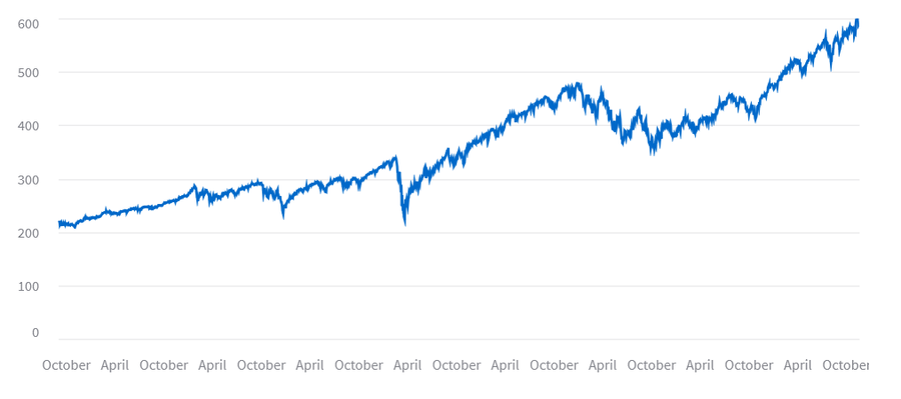

## **📈 Real-Time Stock Prediction using AI & Machine Learning**  

### **🔍 Overview**  
This project uses **AI and Machine Learning** to analyze real-time stock market data and predict future price trends. By leveraging deep learning models such as **LSTMs, RNNs, and Transformers**, it provides accurate forecasting, helping investors and traders make informed decisions.  

---

## **🚀 Key Features**  
- **Real-Time Stock Prediction** – Analyzes live market data to predict price movements.  
- **AI-Powered Insights** – Utilizes **machine learning models** to detect stock trends and patterns.  
- **Deep Learning-Based Forecasting** – Implements **LSTMs, RNNs, and Transformer models** for precise predictions.  
- **Automated Trading Integration** – Connects predictive models with **algorithmic trading strategies**.  
- **High-Frequency Trading (HFT) Analysis** – Processes **large-scale market data** for quick insights.  
- **Data Visualization** – Displays **interactive stock trends and trading signals**.  

---

## **📊 Tech Stack**  

- **Machine Learning**: TensorFlow, Scikit-Learn, XGBoost  
- **Deep Learning**: LSTM, RNN, Transformer Models  
- **Data Processing**: Pandas, NumPy, SQL, yFinance  
- **Visualization**: Matplotlib, Plotly, Seaborn  
- **Web Framework**: Streamlit (for interactive UI)  

---

## **🛠 Installation**  

1️⃣ **Clone the repository:**  
```bash
git clone https://github.com/your-username/real-time-stock-prediction.git  
cd real-time-stock-prediction  
```  

2️⃣ **Install dependencies:**  
```bash
pip install -r requirements.txt  
```  

3️⃣ **Run the application:**  
```bash
streamlit run app.py  
```  

---

## **📈 How It Works?**  

- **Data Collection** – Fetches real-time stock data from APIs like **Yahoo Finance**.  
- **Data Preprocessing** – Cleans and structures stock data for better analysis.  
- **Feature Engineering** – Generates stock market indicators to improve predictions.  
- **Model Training** – Uses **machine learning and deep learning models** for forecasting.  
- **Deployment & Visualization** – Displays **trading signals and stock trends** in real-time.  

---

## **💡 Use Cases**  

- **Stock Market Trend Prediction** – Helps investors analyze stock price movements.  
- **Automated Trading Strategies** – Enhances algorithmic trading execution.  
- **Risk Management** – Predicts **market volatility** for better financial decision-making.  
- **Investment Insights** – Assists traders in **identifying profitable opportunities**.  

---

## **📸 Screenshots**  
### **Real-Time Stock Price Prediction UI**  
  

---

## **📜 License**  
This project is **open-source** and available under the **MIT License**.  

---

## **👨‍💻 Contributing**  
Contributions are welcome! Follow these steps:  

1️⃣ Fork the repository.  
2️⃣ Create a new feature branch (`git checkout -b feature-name`).  
3️⃣ Commit changes (`git commit -m "Added new feature"`).  
4️⃣ Push to the branch (`git push origin feature-name`).  
5️⃣ Open a **Pull Request**.  

---

## **📩 Contact & Support**  
For any queries, feel free to reach out:  

📧 Email: **your-email@example.com**  
🔗 LinkedIn: [Your LinkedIn Profile](https://linkedin.com/in/yourprofile)  
📂 GitHub: [Your GitHub Profile](https://github.com/your-username)  

---

This version **removes the table format** while keeping the content **structured and professional** for your **GitHub and interview**. Let me know if you need any changes! 🚀
